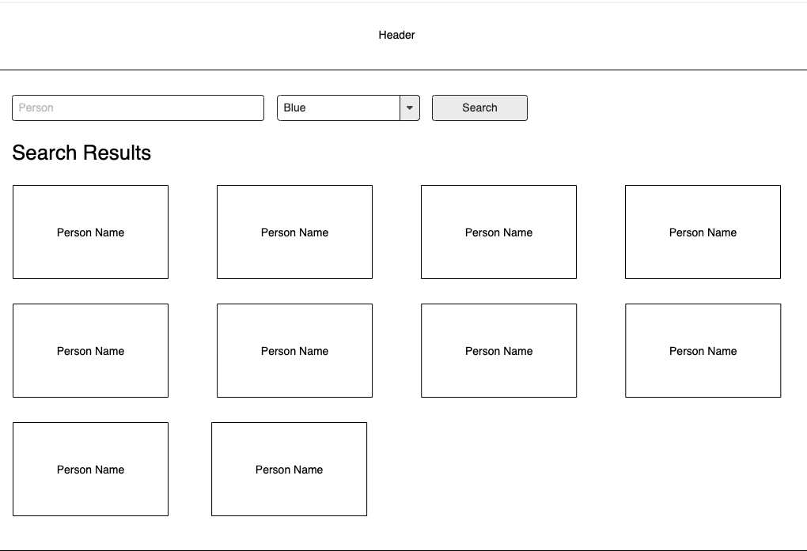

# Frontend Candidate Project

## Setup

- Clone repo
- Run `npm install` to install dependencies
- Run `npm run api` to start the API server (or `npm run api &` to run in background on mac or Linux)
- Run `npm run start` for a dev server. Navigate to `http://localhost:4200/`. The app will automatically reload if you change any of the source files.

## Instructions

Implement a simple application to search for people. This will involve two main screens: the search screen and the details screen. Data will be retrieved making use of an [API](#api) (see details below). Basic screen structure should align with provided [design mockups](#design-mockups) (see details below).

### Search screen

Implement a form that allows the user to search for people. Add form controls to filter/search by name and by their favorite color. The name control should be a text input and the favorite color control should be a dropdown with the option values of `blue`, `red`, and `green`. Add a button to execute the search, and also allow them to search by pressing enter in the name input control.

Display the search results on the page in _cards_ (see [design mockups](#design-mockups)) that display the person's name. A user can click on a result card, which should take them to a details page for that person. Handle the scenario where no search results are found too.

### Details screen

Display the person's name, favorite color, and the person's quotes along with the number of likes for each quote. The quotes should be sorted descending by the number of likes, and then ascending alphabetically.

Display a link that allows the user to go back to the search page, which should display the search results from their most recent search.

### API

#### Search

- Method: GET
- URL: http://localhost:5000/search
- Query string parameters (one or both are required):
    - `term`: name search term
    - `color`: favorite color
- Example response

```
{
    "matches": [
        { "id": 1, "name": "Mergatroid Q. Finkelmeyer" }
    ]
}

```

#### Details

- Method: GET
- URL: http://localhost:5000/details/{id}
- Example Response (key in `quotes` is number of likes; value is quotes that have those number of likes).


```json
{
  "id": 1,
  "name": "Mergatroid Q. Finkelmeyer",
  "favorite_color": "red",
  "quotes": {
    "100": ["The chicken doesn't need a reason.", "When it rains, it pours."],
    "93": ["What goes up must come down.", "What goes down must come up."]
  }
}
```

### Design mockups

These are very low fidelity mockups and are only meant to convey the general layout of the screens. Feel free to make your own decisions on colors, borders, spacing, etc. We are not looking for this to be an evaluation of your user interface design skills, but the app should function in an intuitive way for the users.

#### Search (initial)


#### Search (with results)



#### Details


### Other

- Handle errors from the api calls in a graceful manner and notify the user in some way
- Feel free to add whatever components, services, pipes, directives, etc. that you want
- __*DO NOT*__ add any other npm packages to the repo
- Unit tests are __*NOT NEEDED*__ for this project. However, write your code in such a way that is conducive to being unit tested
